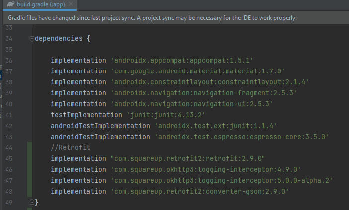
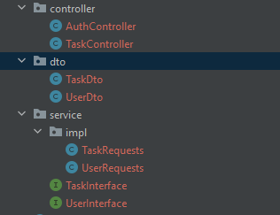

# Configuration services to consume REST API with Retrofit

IETI - LAB10

2022-2.

## Development

In this project it is used the Retroit tool in order to get data from the previously created API for user authentication and task creation and update. 

### Prerequisites

- [ Android Studio ](https://developer.android.com/studio) - Android Studio is the official Integrated Development Environment (IDE) for Android app development, based on IntelliJ IDEA.


### Installing

To download the project run:

```bash
git clone https://github.com/ZulyVargas/Android-Labs
git checkout consume-api
```

## Step by step:

1. Add the dependencies:



2. Create DTO's, interfaces, and controllers for the requests to the API.



## Authors

- **Zuly Valentina Vargas Ramírez**