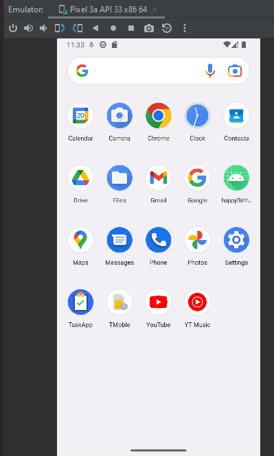

# Create and run your first Android app

IETI - LAB09

2022-2.

## Development

This project is developed following the steps of the following tutorial:

[ basic-android-kotlin-training-first-template-project ](https://developer.android.com/codelabs/basic-android-kotlin-training-first-template-project)

### Prerequisites

- [ Android Studio ](https://developer.android.com/studio) - Android Studio is the official Integrated Development Environment (IDE) for Android app development, based on IntelliJ IDEA.


### Installing

To download the project run:

```bash
git clone https://github.com/ZulyVargas/Android-Labs
git checkout first-app
```

## Step by step:

1. Create a new project with the "Empty Activity" template:


2. Configure the options:


3. After android studio finishes the project setup the files can be seen in the left part of the window:


4. To create a virtual device for the execution and testing of the application, go to the top menu Tools -> Device Manager

    


    After an AVD is created it will appear in the right side menu:

    

    Run te application:

    

5. The application will appear on the device:

    

## Authors

- **Zuly Valentina Vargas Ramírez**
